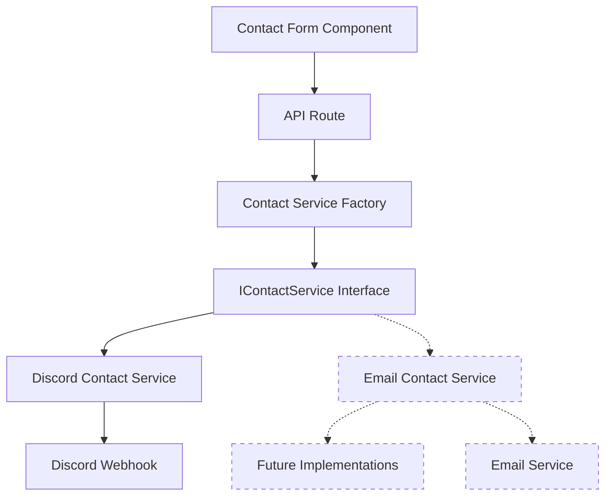

# Contact Service Architecture Diagram

## Component Descriptions

1. **Contact Form Component**: The React component that collects user input and sends it to the API route.
2. **API Route**: A Next.js API route that receives form submissions and uses the Contact Service Factory to process them.
3. **Contact Service Factory**: Creates the appropriate implementation of the IContactService interface based on configuration.
4. **IContactService Interface**: Defines the contract for sending contact form data.
5. **Discord Contact Service**: Implements the IContactService interface to send notifications to Discord via webhooks.
6. **Email Contact Service**: (Future) Implements the IContactService interface to send notifications via email.
7. **Discord Webhook**: The Discord webhook endpoint that receives the notifications.
8. **Email Service**: (Future) An email service that would send email notifications.

## Data Flow

1. User fills out the contact form and submits it
2. The form component sends a POST request to the `/api/contact` endpoint
3. The API route uses the Contact Service Factory to get the appropriate service implementation
4. The service sends the notification to the configured channel (e.g., Discord)
5. The API route returns a success/error response to the form component
6. The form component displays a success/error message to the user
