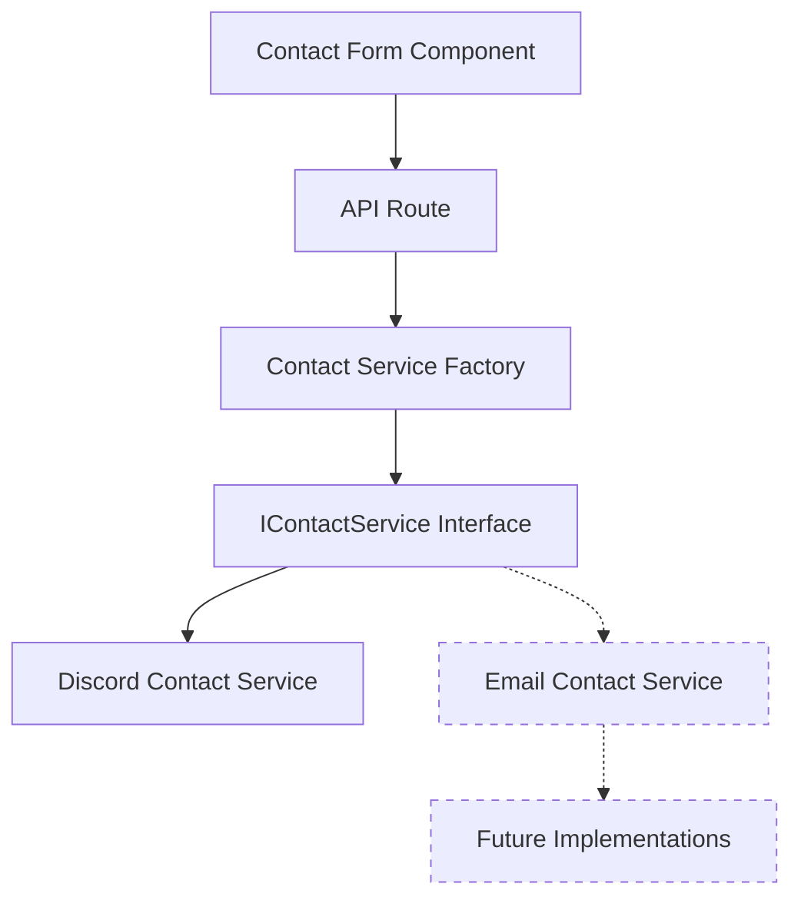

# Soul Solidity Website Architecture

This document provides an overview of the Soul Solidity website architecture, focusing on key components and their interactions.

## Technology Stack

- **Frontend**: Next.js 13, React 18, TailwindCSS
- **UI Components**: Radix UI, Framer Motion
- **Styling**: TailwindCSS with custom components
- **State Management**: React hooks and context
- **API**: Next.js API routes

## Key Components

### Contact Service

The contact service provides a way to send contact form submissions to various notification channels. It uses a dependency injection pattern to allow for multiple implementations.



#### Components

1. **Contact Form Component**: The React component that collects user input and sends it to the API route.
2. **API Route**: A Next.js API route that receives form submissions and uses the Contact Service Factory to process them.
3. **Contact Service Factory**: Creates the appropriate implementation of the IContactService interface based on configuration.
4. **IContactService Interface**: Defines the contract for sending contact form data.
5. **Discord Contact Service**: Implements the IContactService interface to send notifications to Discord via webhooks.
6. **Email Contact Service**: (Future) Implements the IContactService interface to send notifications via email.

## Directory Structure

```
app/
├── api/
│   └── contact/
│       └── route.ts           # API route for contact form submissions
├── components/
│   └── contact.tsx            # Contact form component
└── services/
    └── contact/
        ├── IContactService.ts # Contact service interface
        ├── ContactServiceFactory.ts # Factory for creating contact services
        ├── DiscordContactService.ts # Discord implementation
        └── EmailContactService.ts   # (Future) Email implementation
```

## Data Flow

1. User fills out the contact form and submits it
2. The form component sends a POST request to the `/api/contact` endpoint
3. The API route uses the Contact Service Factory to get the appropriate service implementation
4. The service sends the notification to the configured channel (e.g., Discord)
5. The API route returns a success/error response to the form component
6. The form component displays a success/error message to the user

## Security Considerations

- Sensitive configuration (like webhook URLs) is stored in environment variables on the server
- Form validation is performed both client-side and server-side
- Rate limiting is implemented to prevent abuse
- No sensitive information is exposed to the client
